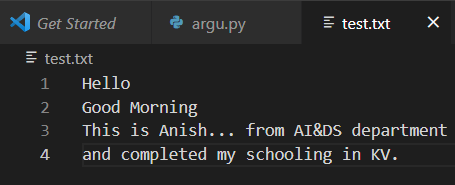
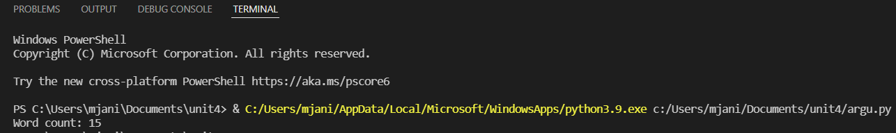

# Word-count
## AIM:
To write a python program for getting the word count from a text.
## EQUIPEMENT'S REQUIRED: 
PC
Anaconda - Python 3.7
## ALGORITHM: 
## Step 1:
Create a text file add sentence to it

## Step 2: 
Using open() open the .txt file in read mode in Python compiler
 
## Step 3: 
Assign a variable for value zero

## Step 4:  
Using the for loop assigning the fp then use variable to split the content
## Step 5: 
Iterate in nested loop to increment the variable

## Step 6: 
Print the variable

# PROGRAM:
~~~
import sys
count=0
with open('test.txt','r') as f:
    for line in f:
        word=line.split()
        count+=len(word)
print('Word count:',count)
~~~

# OUTPUT:

## TEXT FILE:

## OUTPUT

# RESULT:
Thus the program is written to find the word count from a text.
